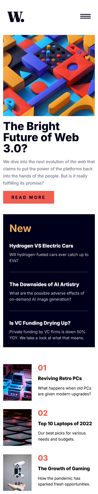

# Frontend Mentor - News homepage solution

This is a solution to the [News homepage challenge on Frontend Mentor](https://www.frontendmentor.io/challenges/news-homepage-H6SWTa1MFl). Frontend Mentor challenges help you improve your coding skills by building realistic projects. 

## Table of contents

- [Overview](#overview)
  - [The challenge](#the-challenge)
  - [Screenshot](#screenshot)
  - [Links](#links)
- [My process](#my-process)
  - [Built with](#built-with)
  - [What I learned](#what-i-learned)
- [Author](#author)

**Note: Delete this note and update the table of contents based on what sections you keep.**

## Overview

### The challenge

Users should be able to:

- View the optimal layout for the interface depending on their device's screen size
- See hover and focus states for all interactive elements on the page

### Screenshots

#### Desktop


#### Mobile




### Links

- Solution URL: [https://github.com/Akiz-Ivanov/news-homepage](https://github.com/Akiz-Ivanov/news-homepage)
- Live Site URL: [https://akiz-ivanov.github.io/news-homepage/](https://akiz-ivanov.github.io/news-homepage/)

## My process

### Built with

- Semantic HTML5 markup
- CSS custom properties
- Responsive layout with CSS Grid & Flexbox
- Mobile-first workflow
- Vite
[](https://react.dev/)
[]

### What I learned

I learned that aligning separate CSS Grid containers often requires matching column structures to maintain vertical visual alignment across sections.

```css
  .top-section-grid {
    grid-template-columns: repeat(3, 1fr);
  }
  .numbered-articles-grid {
    grid-template-columns: repeat(3, 1fr);
  }
```

## Author

- Frontend Mentor - [@Akiz97](https://www.frontendmentor.io/profile/Akiz97)
- GitHub - [@Akiz-Ivanov](https://github.com/Akiz-Ivanov)